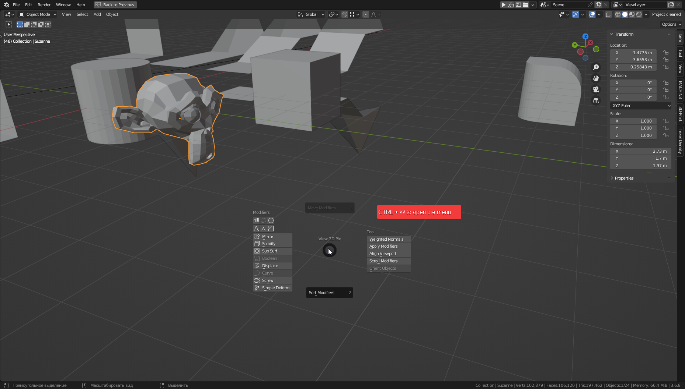
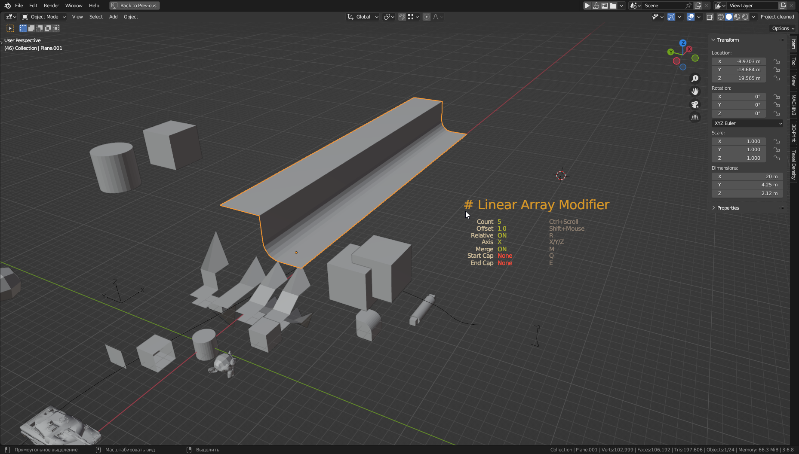
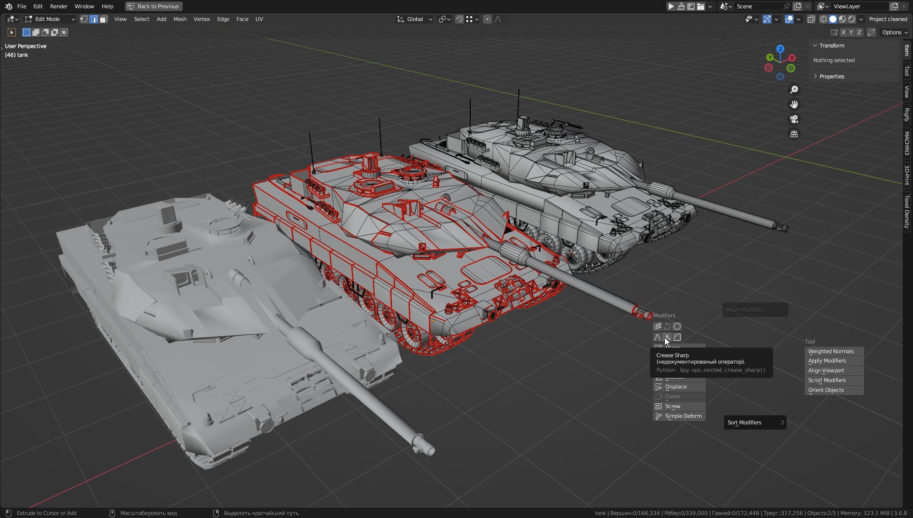
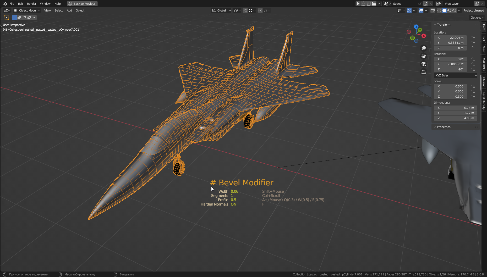
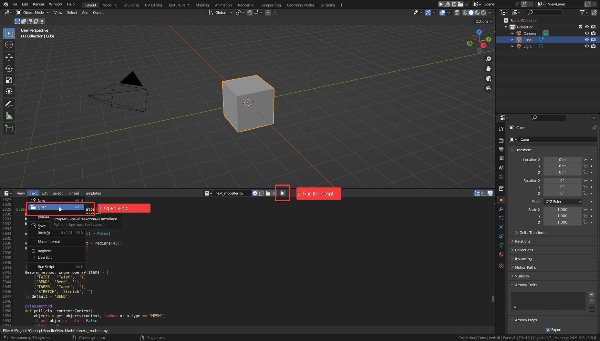

# Blender Modeller Addon

Your favorite operators now in the pie menu, use them in combination with HUD panel!

Also there are some custom operators such as smart `Crease Sharp` operator which automatically detects edges for UV unwrapping and edge creasing.

## Demo

## Screenshots

Use `CTRL + W` to open pie menu

## Installation

Required blender 3.6 to install

